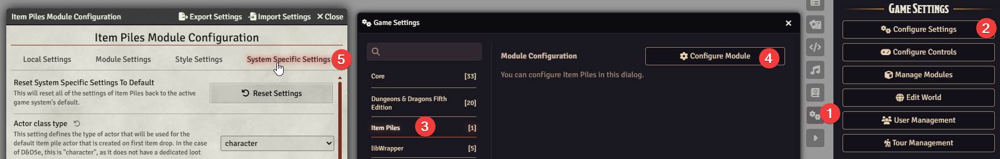
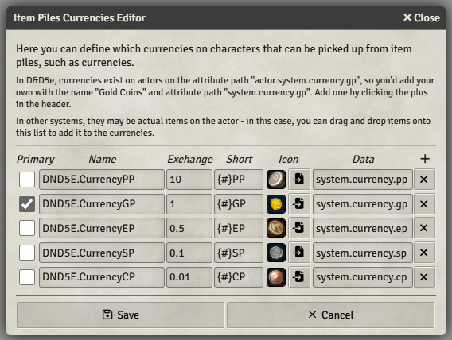
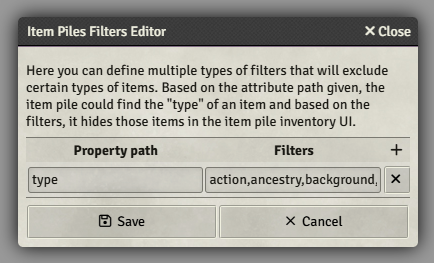
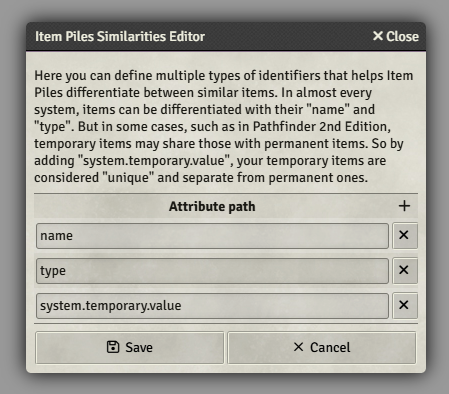
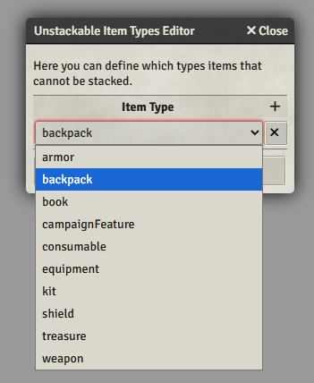

<style lang="css">
.status-pill {
  background-color: rgb(164, 164, 164);
  border: none;
  color: white;
  padding: 2px 7px;
  text-align: center;
  text-decoration: none;
  display: inline-block;
  border-radius: 10px;
  font-size: 0.85em;
  margin: 0px 3px;
  text-transform: uppercase;
}

.status-pill-primary {
  background-color: rgb(62, 138, 204);
}

.status-pill-success {
  background-color: rgb(88, 185, 87);
}

.status-pill-info {
  background-color: rgb(12,158,189);
}

.status-pill-warning {
  background-color: rgb(242, 174, 67);
}

.status-pill-danger {
  background-color: rgb(219, 82, 75);
}
</style>

# Configuring Item Piles For Systems

## System Agnostic

Item Piles is system agnostic, meaning it works on all systems, but it requires configuring to make sure it knows how to handle the system's specific setup.

All systems decide, on their own, which item types are physical items and which aren't, but item piles can't know this without you telling them!

## What should I do?

First, go through this checklist:

1. Is there an Item Piles compatibility module for your system? Check [foundry's module list](https://foundryvtt.com/search/?type=package&q=item+piles).
2. Does your system support Item Piles directly? Ask in your system's discord channel on [foundry's discord server](https://discord.gg/foundryvtt).
3. If all of the above says no - continue below!

## System Settings

All system settings can be found in the configuration menu → configure settings → Item Piles → configure module → system specific settings.



### Actor Class Type

<span class="status-pill status-pill-danger">Required</span>

In order to support systems directly, Item Piles must know which actor type to spawn when the first item pile is created.

Select the most sensible option in the dropdown, picking a "loot"-specific type if it exists.

### Item Loot/Weapon/Equipment Class Type

<span class="status-pill status-pill-info">Optional</span>

These settings does not affect Item Piles as much, as it is for other modules, such as [Better Rolltables](https://foundryvtt.com/packages/better-rolltables/).

### Item Quantity Attribute

<span class="status-pill status-pill-danger">Required</span>

This determines how item piles knows how to handle items that can stack and have a quantity.

If you begin typing `system` in this field, you can often find `system.quantity` or similar (like `system.qty`). If there is a `system.quantity.value`, it is recommended that you use that.

### Item Price Attribute

<span class="status-pill status-pill-danger">Required</span>

This determines how item piles knows how items are priced. This is required for functioning merchants.

If you begin typing `system` in this field, you can often find `system.cost` or similar - this largely depends on the system.

**Note:** If your system has multiple prices for items, you merchants cannot be supported without an item piles system compatibility module.

### Currencies

<span class="status-pill status-pill-danger">Required</span>



This determines how item piles find the currencies on characters in this system, which is used in looting and on merchants.

By pressing the `+` button, or by dragging an item into the interface, you can add item piles recognized currencies to your world.

In order, these are the settings for currencies:

#### Primary

This sets this currency to be the primarily shown currency. On merchants, everything rounds to the nearest whole value of this currency.

#### Name

This is the name of this currency. This input accepts a localization string.

#### Exchange

This is the exchange rate of the _primary currency_ versus other currencies. In this case of D&D5e:

- 1 platinum makes 10 gold (hence it is 10)
- 1 gold makes 1 gold (hence it is 1)
- 2 electrum makes 1 gold (1/2 = 0.5)
- 10 silver makes 1 gold (1/10 = 0.1)
- 100 copper makes 1 gold (1/100 = 0.01)

#### Short

This is how this currency displayed in some item piles interfaces - in this case, `{#}` is replaced with the number of that currency, followed with its abbreviation. In the case of a system that uses a symbol-based abbreviation, you could use:

- Five dollars
  - `${#}` → `$5`
- Five yen/yuan
  - `¥{#}` → `¥5`
- Five krona
  - `{#}kr` → `5kr`

#### Icon

This is the icon displayed on item piles' interfaces when this currency is shown

#### Data

This can be displayed in two ways; as an input or as a button;

- *Input*: This is the path to characters' currencies, typically found in their `systems`, similar to how the [Item Quantity Attribute](#item-quantity-attribute) works, but for characters. If you're not sure how to go about finding this, copy paste the text below into a macro, select a player token, then check the console (click F12, and press the console tab at the top). Then you can expand the data by pressing the > button next to the latest line in the console.
  ```javascript
    console.log(token.actor.toObject());
  ```
- **Button**: This is instead a button that will open the item that was added to the currencies. If a character possesses an item that is alike this (see [Item Similarities](#item-similarities)), they will be considered to have a currency of this type, and can use it in item piles. Editing this item does not edit all existing items of this type, but will change all items of this type when created going forward.

### Secondary Currencies

<span class="status-pill status-pill-info">Optional</span>

The same as [currencies](#currencies), but for ones considered currencies, but aren't native to the system. You can, for example, add a voucher-type item that when possessed by characters, they can purchase additional items at merchants.

### Currency Decimal Digits

<span class="status-pill status-pill-info">Optional</span>

If you only have one currency, this is configurable, which then sets how many decimals a single currency can have. For example, if set to `0.01`, the most that the single currency can have in decimals are two, e.g. `2.11` or `5.99`. If set to 0.001, it can have three, e.g. `2.112` or `5.991`.

### Item Filters

<span class="status-pill status-pill-danger">Required</span>



This is critical to item piles functioning, as it configures which items **are not physical items**. In order for item piles to know what to filter, it must be told what is and isn't valid.

In 95% of all configurations, you want at the very least a single entry with `type` in the **Property Path**, and a comma-separated list of all the values of item `type`s that **aren't physical items**.

To find these, you can create a new macro, paste the below into that macro, then run it, open the console (press F12, then click the console tab), and see what it prints out:

```javascript
console.log(Object.keys(CONFIG.Item.typeLabels).join("\n"))
```

In the case of PF2e, you get this list:

```
base
action
ancestry
affliction
armor
background
backpack
book
campaignFeature
class
condition
consumable
deity
effect
equipment
feat
heritage
kit
lore
melee
shield
spell
spellcastingEntry
treasure
weapon
```

So we want to keep all lines that **aren't** physical items (and remove base, too), so we are left with:

```
action,ancestry,affliction,background,campaignFeature,class,condition,deity,effect,feat,heritage,kit,lore,melee,spell,spellcastingEntry
```

Once saved, none of these types of items show up in item piles' interfaces, and cannot be looted, placed on the ground, sold to merchants, or traded between characters.

### Item Similarities

<span class="status-pill status-pill-danger">Required</span>



In this case, this is a critical setting as well. It determines how items are determined to be the same item.

If a character is given a Temporary Healing Potion item from their companion, and they already have a (non-temporary) Healing Potion in their inventory, item piles requires this setting to be able to tell the difference between the items.

In a similar fashion as [Item Filters](#item-filters), you add additional values to this interface for item piles consider when checking if items are the same.

The example image above is from PF2e, so all items that are `name`d the same, and are of the same `type`, and have the same value in `system.temporary.value` are considered the same type of item.

### Unstackable Items

<span class="status-pill status-pill-info">Optional</span>



In some systems, there are items that cannot be stacked; in other words, they have no quantity by themselves. Even with correctly configured [Item Similarities](#item-similarities), item piles may try to stack items that aren't able to stack.

By adding a new entry, you can select an item type for this entry. When this item is looted, it is **always** considered unique, and will never stack with other items that are exactly the same when looted, bought, or sold.