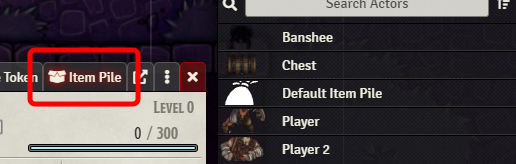
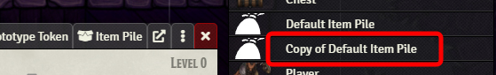
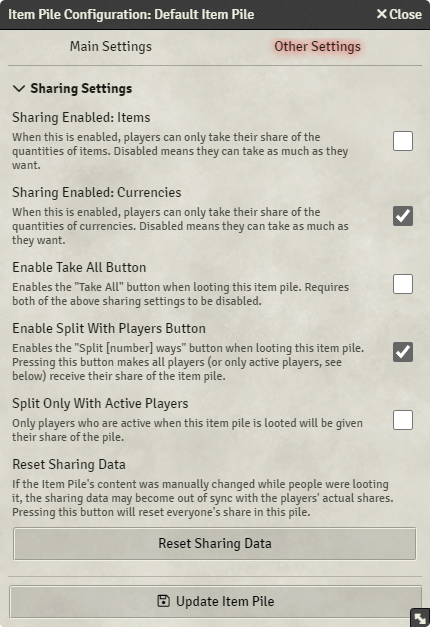

# Creating item piles

## Getting started

When you first drag and drop an item on the canvas, you will be prompted by a dialog whether you want to create a new
item pile. Holding **Left Alt** before drag and dropping will immediately create the default item pile.

As a GM, you can configure the default item pile, but keep in mind that the default item pile is designed to be
temporary and used by players, so modifying it comes with risks and unintended behavior. If you want to experiment with
different item pile setups, duplicate the default item pile, and then configure it by opening the actor sheet and
clicking on "Item Pile" in the sheet's the header bar.

### Avoid changing the default item pile

### Duplicate and change copy instead

## Adding items to existing item piles

If you drag and drop an item on an existing item pile, you will be prompted whether you want to add it to that pile.
Again, holding **Left Alt** before drag and dropping the item will circumvent the dialog and add one of that item to the
item pile.

You can also open the item pile and drag and drop items into the interface.

*Chest is
from [Forgotten Adventures](https://www.forgotten-adventures.net/product/map-making/assets/table-clutter-pack-08/)*

## Inspecting pile as character

If you are a player, you can inspect piles by double-clicking on them. You need to have a token next to the item pile in
order to inspect it, unless the item pile configured has a larger interaction distance (see documentation).

As a GM, you can inspect any pile by first selecting a token on the scene, then holding **Left Control** and
double-clicking on the item pile. This way you inspect **as** that token, which means any items you take from the pile
will be added to that character's inventory.

*Chest is
from [Forgotten Adventures](https://www.forgotten-adventures.net/product/map-making/assets/table-clutter-pack-08/)*

## Modifying default sharing behavior

The default item pile has been set up to best suit common table rules, where items are relatively free for all, whilst
currencies _must_ be split with the rest of the party. All of this can be configured through the item piles
configuration interface. By clicking on the default item pile in the right-hand actor sidebar, you can then click on
the **Configure** button in the header to configure its settings.

The image below shows the various options available to change about the default behavior of item piles:

