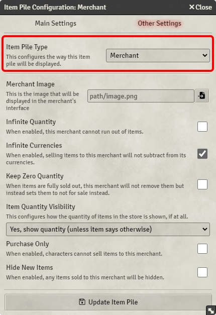

# Merchants

As all piles created by Item Piles are actors, the module can show different UIs and behave differently depending on the
configuration of the pile in question.

You can make a character into a merchant by setting the item pile type to Merchant:



**Note:** You still need to enable it as an item pile in the Main Settings tab.

## Merchant interface

After you have turned an actor into an item pile merchant, you can click on the actor in the sidebar or double-click on
the token in your scene to open the interface.


You can drag and drop items from compendiums or the right-hand item sidebar, and if you select a token like if you were
to [inspect an item pile as a character](basic-use.md#inspecting-pile-as-character), you can buy items from the
merchants using that character. That character's currencies will be shown at the bottom of the list of goods for sale.

As a GM, you can quickly hide and prevent the sale of specific items by clicking the eye and stall icons, respectively.
Hidden items can't be bought, and items not for sale still show up in the interface, but characters can't buy them. This
is useful if you want to tantalize players with the prospect of being able to buy specialized items in the future, but
not until they've helped the merchant with some quest, perhaps!

You can click on the names of items to edit them, and you can quickly edit the item piles settings on items by clicking
the cogwheel icon.

## Buy and sell price modifiers

Every merchant may have a different modifier for how much the base price of items are modified by. So an upscale
leatherworker may sell their items are 120% normal price, because the quality of their goods are naturally better,
whilst a dingy and eccentric gnome alchemist may charge only 75% the normal price for their potions, but they may have
unintended consequences.

In the configuration of the merchant, you can set the buy and sell price modifiers. The sliders go between 0% and 200%,
but you can manually set the price modifier above the limit by typing in your desired number in the input next to the
slider.

Below the sliders, you have the item type price modifiers and per-actor price modifiers, which can configure the
merchant's modifiers on an item type basis, and on an actor-to-actor basis. This means that you can give the loudmouth
bard a discount at the frequented upscale tailor, but apply a markup at the quiet alchemists' shop.

By default, the **modifiers act as a multiplier** on top of each other, but you can toggle whether it is an override or
not in each of the editors.


## Item configuration

As some items may need specialized prices or behavior, the module has added the ability to configure individual items.
If you click the cogwheel on an item in a merchant's inventory or open the item and click the "Configure" button in its
header, you will open the item configuration UI:


As you can see, there are lots of options for various configurations. You can turn items into services, which will be
displayed in the merchant's interface under a different tab, you can make the specific item have infinite quantity when
sold by merchants, and you could make the item have a custom price.

## Custom item prices

As mentioned above, you can configure items to cost other items or a certain amount of a certain property on the buyer,
such as their health.


By clicking "Add Purchase Option" you will add a price group, which can contain multiple costs. In order to purchase
this item, the buyer must have enough to cover all the costs in the price group. If the item has multiple price groups,
the buyer can choose which price group they would like to purchase the item with.

Once you have added a group, you simply click on the "Click to add an attribute..." text below the header. You can also
drag and drop items here to add them as a price. When items are added to the price like this, it creates a copy of the
item as it was then, so changing the original does not change the price.

Here's an example of an Adamantine Plate Armor that can be bought with 2500 gold pieces OR 10 Adamantine Bars. These
bars are simply just another item, which you could put in item piles in your world or for sale from other merchants:


## Services and custom behavior

Items that are configured to be services (see `Item Is Service` on the item configuration) will not add the item to the
buyer's inventory, but only subtract the currencies from the buyer and the quantity of the service (if not infinite
quantity).

If you wish to create additional behavior when you buy an item, you will need to create a macro to handle that additional
logic. Just below `Item Is Service`, you can input the name of a macro that will be executed when the item is purchased.
If you then script behavior that you would like, you can handle any edge case that you would like.

The reason why Item Piles cannot handle "rolling" the item for you is because each system that item piles supports handles
"rolling" differently. Since item piles supports over 20 systems, it would be nearly impossible to implement each one's
edge cases.

Instead, here's an example script that you can run when a `Cure Wounds` service was bought in the D&D5e system.

**Note:** You will need the `advanced-macros` module installed in order for the macro to know what item was bought.

```js
const { buyer, seller, item, quantity } = args[0];

const sellerSpellCastingAttr = seller.system.attributes?.spellcasting || "wis";
const sellerSpellCastingBonus = seller.system.abilities[sellerSpellCastingAttr]?.mod || 0;

const healingRoll = new Roll(`${quantity}d8 + @mod`, { mod: sellerSpellCastingBonus }).evaluate({ async: false });

const buyerNewHealth = Math.min(buyer.system.attributes.hp.max, buyer.system.attributes.hp.value + healingRoll.total);

await buyer.update({
  "system.attributes.hp.value": buyerNewHealth
});

await healingRoll.toMessage({
  flavor: `${seller.name} heals ${buyer.name}`
});
```

In this case `args[0]` contains the buyer actor, the seller actor, the item that was bought, and how many of the item was bought.
