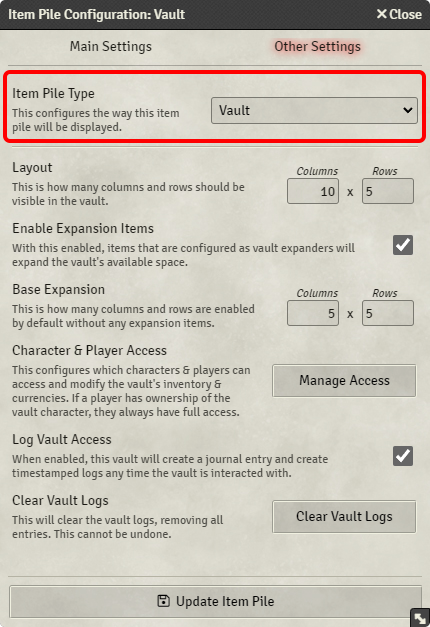
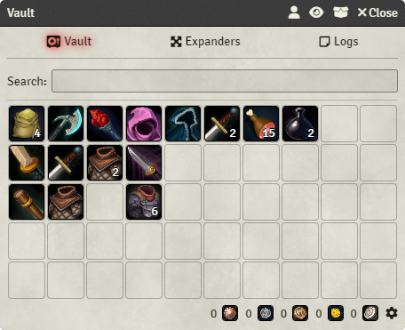
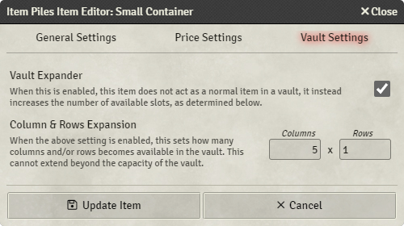
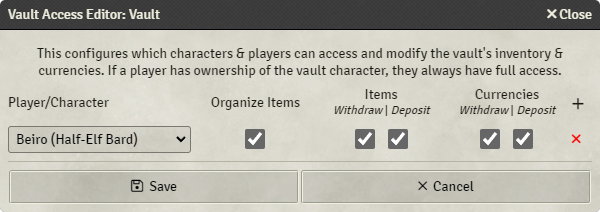

# Vaults

As with all other types of item piles, the Item Piles module only really show different UIs and behave differently depending on the configuration of the actor in question.

By setting the actor to be a vault, you can get that classic World of Warcraft bank or Diablo stash feel:

**Note:** You still need to enable it as an item pile in the Main Settings tab.

## Vault interface

After you have turned an actor into an item pile vault, you can click on the actor in the sidebar or double-click on the token in your scene to open the interface.

You can drag and drop items from other characters, the right-hand item sidebar, or from compendiums into the UI, which will be represented in the grid space. If there is no more space left, you are prevented from dropping another item into it. If you select a token like if you were to [inspect an item pile as a character](basic-use.md#inspecting-pile-as-character), you can take items from the vault using that character.

If you are viewing through a character, it will say so below the grid, and uou can take items by double-clicking on items or right-clicking on items and pressing "Take" in the context menu.

As a GM, you can also manually adjust the currencies in the item pile by clicking the cogwheel in the bottom right. This cogwheel is not visible to anyone but GMs.

## Expanders

If `Enable Expansion Items` is turned on within the vault, the grid will have the number of columns and rows as configured with the `Layout` setting, but only a certain amount of them can actually have items in them. More columns and rows can be enabled through the `Base Expansion` setting which configures the base set of columns and rows enabled by default.

However, in the configuration of items, you can set them to be `Vault Expander`s. When these items are added to a vault, they enable more columns and rows for you to use. They are not shown in the grid view, but in a separate tab.

## Vault Access

If you give ownership of a vault to a player, they can move items around, deposit and withdraw items, and deposit and withdraw currency at will. However, if you want to create a collective vault for multiple players or characters, you can grant individual permissions per player or character through the Vault Access Editor.

If you so wish, you can allow people to deposit items, but not withdraw them - or simple just allow them to organize the items in the grid and nothing else.
